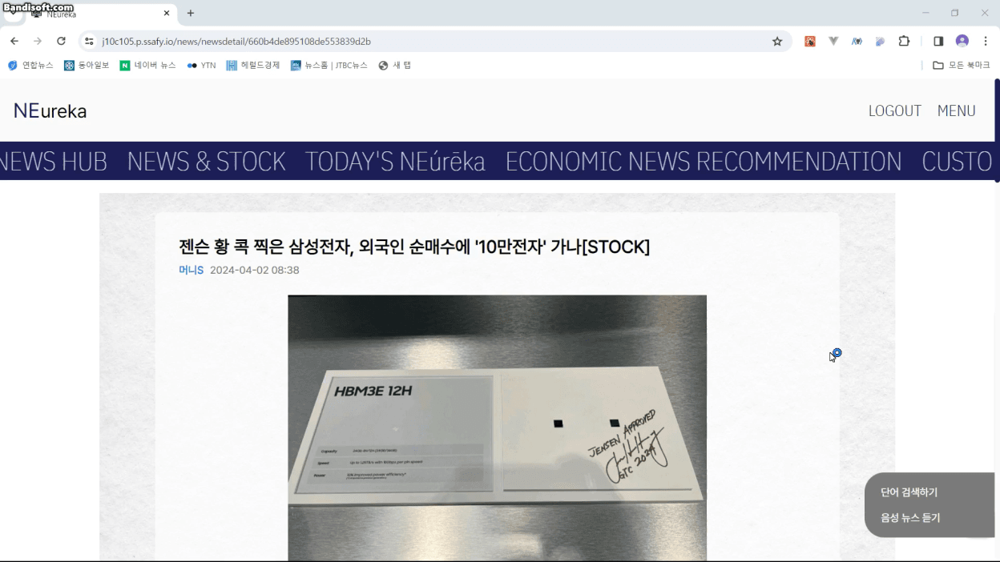
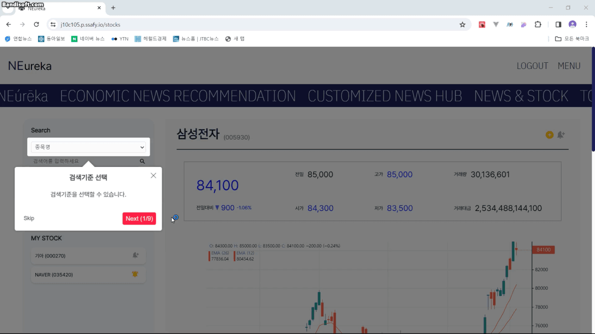

## 1. 홈 화면

### 화면

### 시연 내용

-
-
-

---

 
 

## 2. 뉴스 기사 전체 조회 화면

### 화면

### 시연 내용

-
-
- -ㄴㅇㄴ

---

 
 

## 3. 뉴스 기사 상세 조회 화면

### 화면

### 시연 내용

-
-
- -ㄴㅇㄴ

---

 
 

## 4. 상장 기업 조회 화면

### 화면

### 시연 내용

-
-
- -ㄴㅇㄴ

---

 
 

## 5. 경제 용어 사전

### 화면

### 시연 내용

-
-
- -ㄴㅇㄴ

---

 
 

## 6. 뉴스 요약 메일링 서비스

### 화면

### 시연 내용

-
-
- -ㄴㅇㄴ

---

 
 

## 7. 뉴스 본문 음성듣기

### 화면

### 시연 내용

-
-
- -ㄴㅇㄴ

---

 
 

## 8. 튜토리얼 기능

### 화면

### 시연 내용

-
-
- -ㄴㅇㄴ

---

 
 
